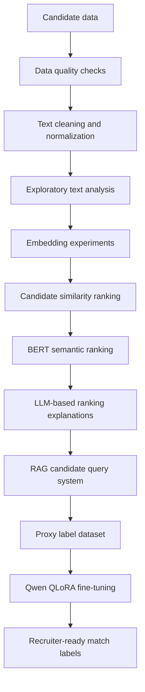

# AI-Powered Talent Screening and Candidate Ranking

Machine learning and LLM-based candidate ranking system built for an Apziva project. The project explores how recruiters can move from manual keyword search toward a more consistent, explainable, and scalable talent-screening workflow.

The solution cleans candidate profile text, compares multiple NLP ranking approaches, selects a transformer-based semantic ranking method, adds LLM-generated recruiter explanations, builds a Retrieval-Augmented Generation (RAG) prototype, and includes a QLoRA fine-tuning workflow for proxy match-label classification.

## Project Summary

Recruiting teams often need to identify promising candidates from short profile summaries, job titles, locations, and limited structured data. Manual screening is time-consuming, inconsistent, and highly dependent on exact keyword matches.

This project addresses that problem by building an AI-assisted candidate screening pipeline that can:

- Clean and normalize candidate profile text.
- Rank candidates against a target role or search phrase.
- Compare traditional NLP, static embedding, and transformer-based methods.
- Use BERT embeddings to capture semantic similarity beyond exact keyword overlap.
- Generate recruiter-friendly explanations using LLM prompting.
- Retrieve candidate information through a LangChain, OpenAI, and FAISS RAG pipeline.
- Fine-tune a small Qwen language model with QLoRA to classify candidates into match labels.

## Repository Structure

```text
.
|-- README.md
|-- Potential Talents-Human Resources.ipynb
|-- Potential Talent RAG/
|   |-- README.md
|   |-- RAG_Potential Talents.ipynb
|   `-- Potential_Talents_Proxy_Labels.xlsx
`-- fine_tune Model/
    |-- Readme.md
    `-- Qwen3_Proxy_Labels_Colab.ipynb
```

## Main Artifacts

| Artifact | Purpose |
| --- | --- |
| [Potential Talents-Human Resources.ipynb](Potential%20Talents-Human%20Resources.ipynb) | Main candidate-ranking notebook with preprocessing, EDA, embeddings, BERT ranking, LLM prompting, and RAG exploration |
| [RAG_Potential Talents.ipynb](Potential%20Talent%20RAG/RAG_Potential%20Talents.ipynb) | Standalone RAG workflow using LangChain, OpenAI embeddings, and FAISS |
| [Potential_Talents_Proxy_Labels.xlsx](Potential%20Talent%20RAG/Potential_Talents_Proxy_Labels.xlsx) | Proxy-labeled candidate dataset used by the RAG and fine-tuning workflows |
| [Qwen3_Proxy_Labels_Colab.ipynb](fine_tune%20Model/Qwen3_Proxy_Labels_Colab.ipynb) | Google Colab notebook for Qwen QLoRA fine-tuning |

## Business Objective

The objective is to support recruiters and hiring teams by ranking candidates according to their relevance to a target role. Instead of relying only on literal keyword matches, the project evaluates candidate intent and semantic fit from text fields such as job title, profile summary, and location.

For example, a recruiter searching for `aspiring human resources` should be able to surface candidates whose profiles express the same intent, even when the wording varies across titles such as:

- `aspiring human resource specialist`
- `aspiring human resource professional`
- `student aspiring human resource generalist`
- `seeking human resource position`

## End-to-End Workflow



## Step-by-Step Project Flow

### 1. Data Loading and Understanding

The baseline notebook starts with an anonymized candidate dataset containing:

| Column | Description |
| --- | --- |
| `id` | Unique candidate identifier |
| `job_title` | Candidate title or profile headline |
| `location` | Candidate location |
| `connection` | Number of professional connections |
| `fit` | Candidate fit score placeholder |

The initial HR-focused notebook works with 104 candidate records. The RAG and fine-tuning workflow uses `Potential_Talents_Proxy_Labels.xlsx`, which contains 1,313 rows total and 1,285 labeled rows across `low_match`, `medium_match`, and `high_match`.

### 2. Data Quality Checks

The project checks:

- Missing values
- Duplicate rows
- Repeated or semantically similar job titles
- Distribution of candidate titles
- Data types and dataset shape

This step is important because candidate data often contains repeated profiles, inconsistent wording, and short text fields that can strongly affect ranking quality.

### 3. Text Cleaning and Normalization

The text preprocessing pipeline standardizes candidate titles before modeling:

- Lowercasing
- Removing punctuation, digits, and extra whitespace
- Tokenization with NLTK
- Stopword removal
- Lemmatization

This makes titles more consistent and improves the reliability of downstream similarity calculations.

### 4. Exploratory Text Analysis

A word cloud and frequency review are used to understand the dominant themes in the candidate pool. The HR-focused dataset contains many early-career and aspiration-oriented profiles, including terms related to human resources, students, graduates, specialists, and professionals.

This exploration helps validate that the dataset aligns with the recruiting search scenario and highlights where additional feature engineering may be useful.

### 5. Candidate Ranking Experiments

The project compares several text representation methods:

| Method | Purpose |
| --- | --- |
| TF-IDF | Interpretable keyword-based baseline |
| GloVe | Static word embedding baseline |
| FastText | Subword-aware embedding method for spelling and wording variation |
| Word2Vec-style averaging | Additional static embedding comparison |
| BERT | Contextual transformer embedding for semantic similarity |

Each method converts candidate titles and the search term into vectors, then uses cosine similarity to rank candidates by relevance.

### 6. BERT-Based Semantic Ranking

BERT was selected as the preferred ranking approach because candidate-role matching depends on semantic meaning, not only exact word overlap.

In the HR ranking experiment, BERT surfaced the strongest matches as profiles such as:

| Candidate IDs | Candidate Title | BERT Similarity |
| --- | --- | --- |
| 24, 36, 6, 60, 49 | `aspiring human resource specialist` | 0.8975 |
| 3, 17, 33, 46, 97, 58, 21 | `aspiring human resource professional` | 0.8964 |
| 99 | `seeking human resource position` | 0.8336 |
| 73 | `aspiring human resource manager seeking internship human resource` | 0.8218 |
| 74 | `human resource professional` | 0.8107 |

These results show that the ranking system can identify candidates who are highly aligned with the search intent, even when their exact wording differs.

### 7. LLM Prompt Engineering for Recruiter Explanations

After BERT ranking, the notebook extends the workflow with LLM prompting. The goal is to make the results easier for recruiters to interpret by asking models to produce ranked candidate tables, relevance scores, and short explanations.

The project experiments with:

- Local Ollama models
- OpenAI API prompts
- Anthropic API prompts
- Google Gemini prompts

This step turns numeric similarity scores into recruiter-friendly reasoning, helping users understand why a candidate was ranked highly.

### 8. RAG Candidate Query System

The RAG notebook demonstrates a question-answering workflow over the candidate dataset:

1. Load the Excel dataset.
2. Convert candidate rows into LangChain documents.
3. Split the document text into chunks.
4. Create OpenAI embeddings.
5. Store vectors in FAISS.
6. Create a retriever.
7. Pass retrieved context into an LLM prompt.
8. Ask recruiting-related questions about candidates and match labels.

This provides a prototype for querying candidate information conversationally, instead of manually filtering spreadsheet rows.

### 9. Proxy Labels and Fine-Tuning

The fine-tuning notebook converts screening scores into proxy labels:

| Screening Score | Match Label |
| --- | --- |
| 0-30 | `low_match` |
| 31-70 | `medium_match` |
| 71-100 | `high_match` |

The notebook builds supervised fine-tuning examples in chat format:

- System instruction: behave as a recruiting screening model.
- User message: candidate title and location.
- Assistant response: one of the allowed labels.

It then uses:

- `Qwen/Qwen3-0.6B` as the default memory-friendly base model
- QLoRA with 4-bit quantization
- PEFT LoRA adapters
- TRL `SFTTrainer`
- Stratified train, validation, and test splits
- Google Colab GPU runtime

The final adapter is saved to:

```text
/content/qwen3_proxy_labels/final_adapter
```

## Technologies Used

- Python
- Jupyter Notebook
- pandas, NumPy
- NLTK
- scikit-learn
- Matplotlib, Seaborn, WordCloud
- PyTorch
- torchtext
- Hugging Face Transformers
- LangChain
- OpenAI API
- FAISS
- PEFT, TRL, BitsAndBytes
- Google Colab
- Ollama

## How to Run

### Baseline Candidate Ranking Notebook

Open:

```text
Potential Talents-Human Resources.ipynb
```

Run the notebook cells in order. If running locally, make sure the original `Potential Talents.csv` file used by the notebook is available in the repository root.

### RAG Notebook

Install the required packages:

```bash
pip install pandas openpyxl python-dotenv langchain langchain-core langchain-community langchain-openai faiss-cpu
```

Create a `.env` file inside the RAG folder:

```text
OPENAI_API_KEY=your_openai_api_key_here
```

Then open and run:

```text
Potential Talent RAG/RAG_Potential Talents.ipynb
```

### Qwen Fine-Tuning Notebook

Open the notebook in Google Colab:

```text
fine_tune Model/Qwen3_Proxy_Labels_Colab.ipynb
```

Recommended steps:

1. Select a GPU runtime in Colab.
2. Run the dependency installation cell.
3. Upload `Potential_Talents_Proxy_Labels.xlsx`.
4. Build the JSONL training, validation, and test datasets.
5. Run QLoRA fine-tuning.
6. Test the saved adapter on a sample candidate.

## Key Results

- Built an end-to-end candidate ranking workflow from raw candidate text to ranked outputs.
- Compared multiple NLP representation methods instead of relying on one model.
- Selected BERT because it provided stronger semantic matching for short, varied job titles.
- Added LLM prompting so rankings include explanations, not only scores.
- Built a RAG prototype that retrieves candidate context and answers recruiting questions.
- Created a supervised fine-tuning workflow for candidate match-label classification.

## My Contribution

As the project owner, I designed and implemented the complete applied AI workflow:

- Framed the recruiting problem as a ranking and match-labeling task.
- Performed data loading, inspection, cleaning, and exploratory analysis.
- Built and compared multiple NLP candidate-ranking methods.
- Implemented transformer-based semantic similarity with BERT.
- Added LLM prompt engineering for interpretable recruiter-facing explanations.
- Created a LangChain, OpenAI, and FAISS RAG prototype for candidate search.
- Prepared proxy-labeled data and a Qwen QLoRA fine-tuning notebook.
- Documented the workflow so the project can be reviewed, reproduced, and extended.

## Future Improvements

- Add recruiter-validated labels instead of relying only on proxy labels.
- Deduplicate semantically identical candidate profiles.
- Store one candidate per document in the RAG pipeline and attach metadata such as `id`, `location`, and `match_label`.
- Evaluate ranking quality with metrics such as Precision@K, Recall@K, MRR, or NDCG.
- Save and reload the FAISS index instead of rebuilding it each run.
- Build a simple Streamlit or Gradio interface for recruiters.
- Add structured JSON outputs for easier integration with HR systems.

## Data, Privacy, and License Notes

- Candidate records are represented through anonymized identifiers.
- API keys should be stored in a local `.env` file and should not be committed to GitHub.
- The repository does not currently include a formal license file. Add a license before using the project as open-source software or in production.

## Conclusion for Hiring Managers and Recruiters

This project demonstrates my ability to translate a real recruiting problem into a practical AI solution. I worked through the full data science lifecycle: understanding the business objective, preparing noisy text data, comparing modeling approaches, selecting a strong semantic ranking method, adding LLM explanations, prototyping RAG-based search, and extending the solution with fine-tuning.

For hiring teams, the key value is that this project is not only a notebook experiment. It shows applied thinking across machine learning, NLP, LLMs, retrieval systems, and model adaptation. The work reflects the kind of end-to-end contribution needed in modern data science roles: building useful AI workflows, explaining results clearly, and connecting technical choices to business impact.

## Author

**Ibrahim Chaoudi**  
Data Scientist

- GitHub: [Ch-Ibrahim](https://github.com/Ch-Ibrahim)
- LinkedIn: [ibrahimchaoudi](https://www.linkedin.com/in/ibrahimchaoudi/)
- X: [@i_chaoudi_](https://x.com/i_chaoudi_)
- Email: [brahiml_chaoudi@yahoo.com](mailto:brahiml_chaoudi@yahoo.com)
